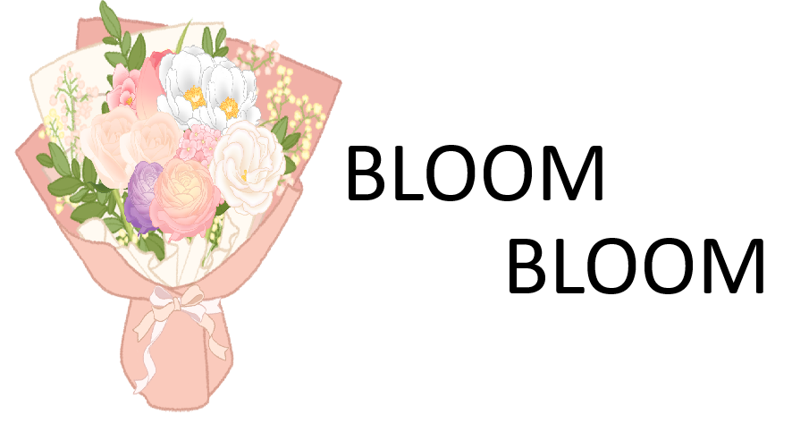
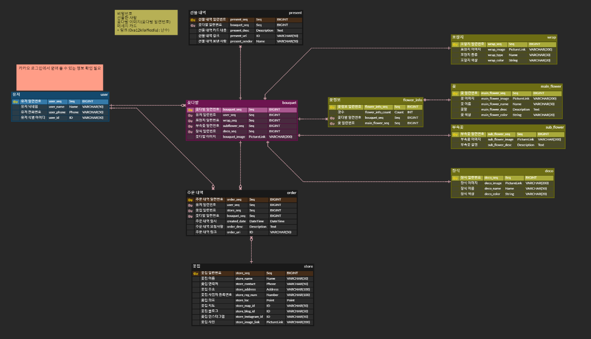
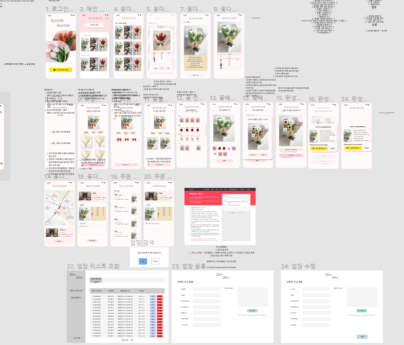
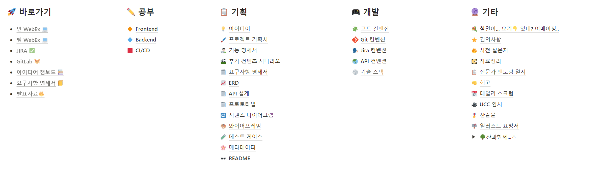
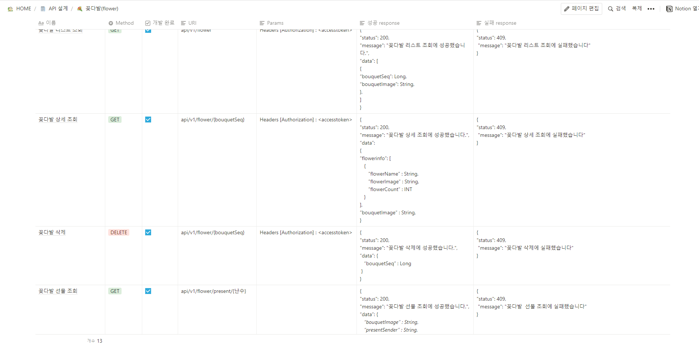
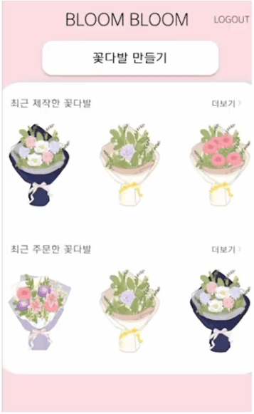
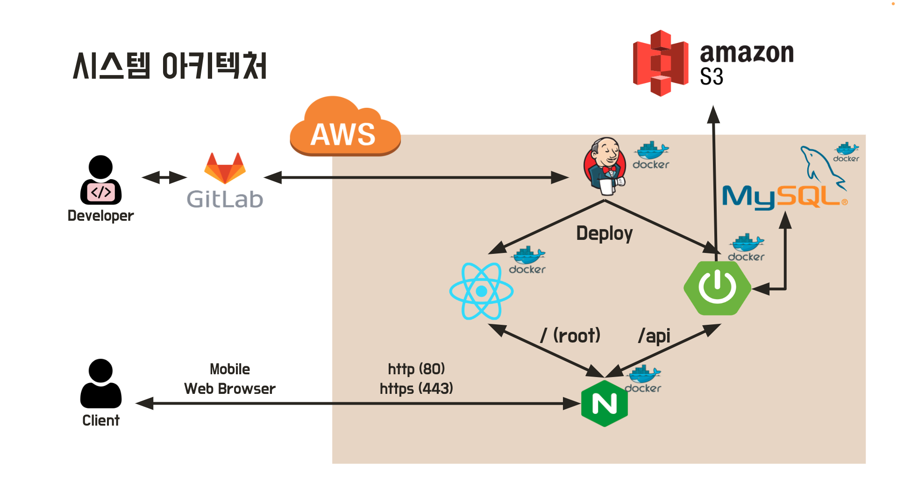

&nbsp;

## 소개 😀

❔ 본인이 원하는 꽃다발을 손 쉽게 만들어서 선물 / 주문하는 방법은 없을까요?

👉 당연히 있습니다. **BLOOM BLOOM** 서비스를 이용하시면 됩니다.

❔ **BLOOM BLOOM**은 무슨 뜻을 가지고 있을까요?

👉  명사로는 '꽃', 동사로는 '꽃을 피우다' 라는 의미를 가지고 있습니다.

&nbsp;

&nbsp;

## 개발 기간 📅

##### 2022.04.28 ~ 2022.05.20 (3주)

&nbsp;

&nbsp;

## 기술 스택 🛠

#### Back-end

&nbsp;&nbsp;&nbsp;

&nbsp;

#### Front-end

&nbsp;&nbsp;

&nbsp;

#### Server

&nbsp;&nbsp;

&nbsp;

&nbsp;

## ERD 📊

&nbsp;

&nbsp;

## 와이어 프레임 📋

&nbsp;

&nbsp;

## 개발 과정 ⌨

&nbsp;

&nbsp;

## 주요 기능 📌

✔ 카카오톡으로 간단하게 BLOOM BLOOM 서비스를 이용할 수 있습니다.

✔ 포장지, 리본, 부속꽃과 꽃잎을 선택하여 나만의 개성있는 꽃다발을 만들 수 있습니다.

|       BLOOM BLOOM 로그인하기        |    로그인 후 메인 페이지    |           꽃다발 꾸미기           |
| :---------------------------------: | :-------------------------: | :-------------------------------: |
|  |  |  |

&nbsp;

✔ 앞서 선택한 꽃을 드래그 앤 드롭을 통해 꽃다발안에 배치할 수 있습니다.

✔ 직접 만든 꽃다발을 확인하고, 메시지와 함께 공유하거나 꽃집에 주문할 수 있습니다.

✔ 꽃다발 주문 시, 현재 위치 근처에 있는 꽃집을 지도로 쉽게 찾고 선택해서 원하는 꽃집에 주문 의뢰를 할 수 있습니다.

|          꽃 배치하기           |      완성된 꽃다발 공유하기       |          꽃다발 주문하기          |
| :----------------------------: | :-------------------------------: | :-------------------------------: |
|  |  |  |

&nbsp;

&nbsp;

## 팀원 구성 🤝

|          김정혁 (팀장)          |             문준호              |             김영후              |             이상원              |             김정연              |             박건우              |
| :-----------------------------: | :-----------------------------: | :-----------------------------: | :-----------------------------: | :-----------------------------: | :-----------------------------: |
|  |  |  |  |  |  |
|        Backend, Frontend        |          Backend, UCC           |            Frontend             |            Frontend             |        Frontend, Design         |         Backend, CI/CD          |

&nbsp;

&nbsp;

##  시스템 아키텍쳐 ⚙

&nbsp;

## UCC 📺

